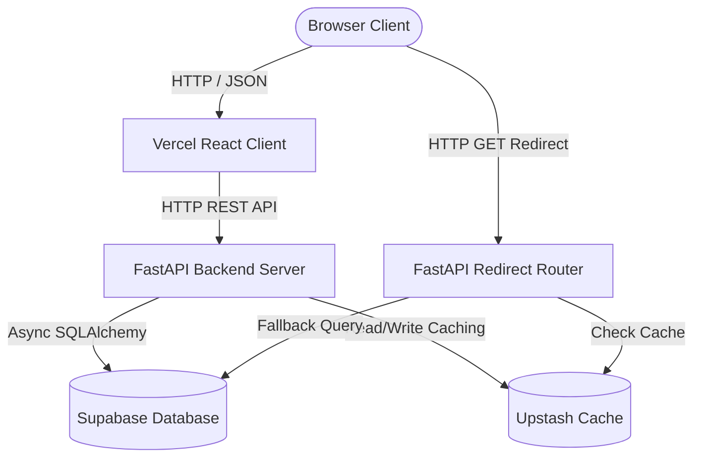

# Brief.ly — Production-Grade URL Shortener & Analytics

Brief.ly is a high-performance, developer-focused URL Shortener & Analytics platform designed for sub-millisecond redirect speeds, reliability, and robust access tracking.

[](https://fastapi.tiangolo.com)
[](https://react.dev)
[](https://www.postgresql.org)
[](https://redis.io)
[](https://opensource.org/licenses/MIT)

---

## 🚀 What It Does
Brief.ly allows users to instantly shorten long web URLs into compact 6-character short codes, support custom aliases, and specify custom expiration datetimes. Registered users gain access to a personal dashboard populated with advanced real-time click charts, geographic analytics, and referral tracking. The entire system is built utilizing async-first protocols to scale to millions of requests without blocking CPU cycles.

---

## 🏛️ System Architecture



---

## ✨ Features
*   **Async Redirect Pipeline**: Sub-millisecond URL redirections utilizing Redis memory caching.
*   **Fail-Open Resilience**: If Redis goes down, the redirection pipeline gracefully falls back to PostgreSQL, guaranteeing 100% uptime.
*   **Advanced Customization**: Support custom short aliases and expiration dates per link.
*   **OAuth2 Integration**: Secure GitHub login flow utilizing persistent session middlewares.
*   **Real-time Analytics**: Tracks daily link clicks, referral domains, and geographic regions.
*   **Rate Limiting**: Enforced via Redis (5 requests/hour for anonymous, 50 requests/hour for logged-in users).

---

## 💻 Tech Stack

| Component | Technology | Role |
|---|---|---|
| **Backend Framework** | FastAPI | Async HTTP Routing & Swagger UI |
| **Database** | PostgreSQL | Persistent relational database storage |
| **Database ORM** | SQLAlchemy 2.0 (Async) | Async Object Relational Mapping |
| **Caching / Rate-limit** | Redis | Memory caching & rate limit counts |
| **Migrations** | Alembic | Version-controlled DB schemas |
| **Authentication** | Authlib + JWT | OAuth2 (GitHub) & JSON Web Tokens |
| **Frontend client** | React + Vite | Fast Single Page Application (SPA) |
| **Styling** | Vanilla CSS | Slate/Blue design system |
| **Testing** | pytest-asyncio | Test suite coverage |
| **Performance** | Locust | Weighted client load simulator |

---

## 🛠️ Local Setup & Running

Follow these steps to run the application locally:

### 1. Database Setup
Create a PostgreSQL database named `urlshortener`.

### 2. Backend Config
Navigate into the `backend/` directory, create a `.env` file, and populate the following keys:
```env
APP_ENV=development
SECRET_KEY=generate_a_random_32_character_hex_key
DATABASE_URL=postgresql+asyncpg://<username>:<password>@localhost:5432/urlshortener
REDIS_URL=redis://localhost:6379
ALLOWED_ORIGINS=http://localhost:5173,http://127.0.0.1:5173
```

### 3. Run Backend Server
```bash
cd backend
python -m venv venv
.\venv\Scripts\activate
pip install -r requirements.txt
alembic upgrade head
python -m uvicorn app.main:app --reload
```

### 4. Run Frontend Client
```bash
cd frontend
npm install
npm run dev
```
Open `http://localhost:5173` in your browser.

---

## 🧪 Running Unit Tests

To execute the test suite (15 unit tests covering auth, redirect logic, limits, validation, and deletion):
```bash
cd backend
.\venv\Scripts\pytest
```

---

## 📊 Performance Testing (Locust)

Weighted user load simulation (70% redirect checks, 20% creation, 10% analytics checking):
```bash
cd backend
.\venv\Scripts\locust -f load-tests/locustfile.py --headless -u 10 -r 2 --run-time 30s --host http://localhost:8000
```

### Baseline Performance Results
*   **Total Requests**: 51
*   **Failed Requests**: 0 (0.0% failure rate)
*   **Average Latency**: 1395 ms
*   **Median Latency**: 50 ms
*   **95th Percentile Latency**: 5800 ms

---

## 💡 What I Learned
*   **Fail-Open Design**: Caching is critical for hot paths, but it shouldn't introduce a single point of failure. Wrapping Redis clients in safety blocks ensures uptime even during service failure.
*   **Database Transaction Timing**: Traditional transaction commits at middleware levels cause race conditions when clients reload state instantly after deletion. Committing explicitly inside repository layers prevents stale client states.
*   **Async Contexts**: Combining asynchronous routes with background tasks enables non-blocking analytics writes, giving users immediate redirections.

---

## 📄 License
This project is licensed under the MIT License - see the LICENSE file for details.
